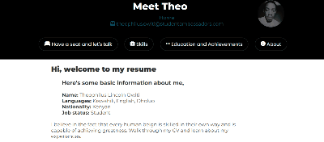

# Technical Onboarding portfolio

## Welcome to my onboarding portfolio

 

### Every section explains my different aspects

Most explained concepts are based on different milestones

## Repository Information

Other details like contributions, merges and others can be found on the repository or profile